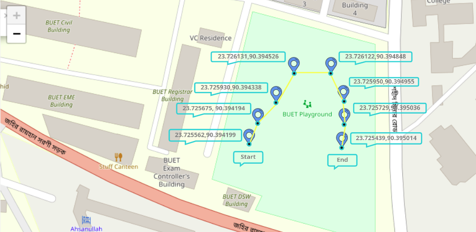

# GPS-waypoint-based-Autonomous-Navigation-in-ROS
GPS points will be predefined for the robot to navigate to the destination avoiding obstacles.

This repo package was tested on a Custom Rover with Razor 9DOF IMU, ZED F9P (RTK2) GPS, and RPLidar A1 lidar. The base station laptop is running Ubuntu 16.04 and the rover is running Ubuntu 16.04 on an Nvidia Jetson TX2. 

## Motivation
This work was performed to participate in University Rover Challenge (URC) 2019 for Team Interplanetar (BUET Mars Rover Robotics Team). Special thanks goes to Daniel Snider for open sourcing his work:
- ROS Rover <[code](https://github.com/danielsnider/ros-rover)>
- Simple Drive <[code](https://github.com/danielsnider/simple_drive)> <[ROS Wiki](http://wiki.ros.org/simple_drive)>
- Follow Waypoints <[code](https://github.com/danielsnider/follow_waypoints)> <[ROS Wiki](http://wiki.ros.org/follow_waypoints)>
- GPS Goal <[code](https://github.com/danielsnider/gps_goal)> <[ROS Wiki](http://wiki.ros.org/gps_goal)>
- ROS Offline Google Maps for MapViz <[code](https://github.com/danielsnider/MapViz-Tile-Map-Google-Maps-Satellite)>
- Advanced Terminal Organization <[code1](https://github.com/teamr3/URC/blob/master/.tmuxinator.yml)> <[code2](https://github.com/teamr3/URC/blob/master/devstuff/dan/.tmuxinator.yml)>

## Run the package

In your terminal, navigate to your catkin_ws's source (src) directory & run:
```
cd catkin_ws/src
git clone https://github.com/ArghyaChatterjee/gps-waypoint-based-autonomous-navigation-in-ros.git
cd ..
catkin_make
```
In that terminal, launch the navigation file:
```
source devel/setup.bash
roslaunch gps_waypoint_nav gps_waypoint_nav.launch
```
In another terminal, launch the joystick controller file:
```
source devel/setup.bash
roslaunch gps_waypoint_nav joy_launch_control.launch
```
Run the rover with the joystick. During the run, press "LB" to start collecting waypoints. The waypoints will be saved inside 'points_outdoor.txt'. When the run is finished, press "RB" to start following waypoints. 

<p align="center">
    
</p>

## Package Description
This package uses a combination of the following packages:

   - ekf_localization to fuse odometry data with IMU and GPS data.
   - navsat_transform to convert GPS data to odometry and to convert latitude and longitude points to the robot's odometry coordinate system.
   - GMapping to create a map and detect obstacles.
   - move_base to navigate to the goals while avoiding obstacles 
   - goals are set using recorded or inputted waypoints.

## Node Description
The Navigation package within this repo includes the following custom nodes:
	
   - gps_waypoint to read the waypoint file, convert waypoints to points in the map frame and then send the goals to move_base.
   - gps_waypoint_continuous1 for continuous navigation between waypoints using one controller. 
   - gps_waypoint_continuous2 for continuous navigation between waypoints using another seperate controller.
   - collect_gps_waypoint to allow the user to drive the robot around and collect their own waypoints.	
   - calibrate_heading to set the heading of the robot at startup and fix issues with poor magnetometer data.
   - plot_gps_waypoints to save raw data from the GPS for plotting purposes.
   - gps_waypoint_mapping to combine waypoint navigation with Mandala Robotics' 3D mapping software for 3D mapping.

## Convert lattitude-longitude to local odometry message
If you want to convert /navsat/fix topic from gps sensor to /navsat/odom topic (local cordinate frame), use these 2 packages directly:
- Geonav Transform <[code](https://github.com/bsb808/geonav_transform)> <[ROS wiki](http://wiki.ros.org/geonav_transform)>
- Geographic Info <[code](https://github.com/ros-geographic-info/geographic_info)> <[ROS wiki](http://wiki.ros.org/geographic_info)> <[website](http://library.isr.ist.utl.pt/docs/roswiki/navsat_odometry.html)> <[ROS wiki2](http://wiki.ros.org/navsat_odometry)>


## Details Understanding of the package
- [ROS Extra Class #2: How to use GPS to do autonomous robot navigation?](https://www.youtube.com/watch?v=cmOplaq8cHc)

## GPS related ros drivers
- GPSD <[code](https://github.com/ros-drivers/gps_umd)> <[ROS Tutorial](https://wiki.ros.org/gpsd_client/Tutorials/)>

## Related Issues
- [Robot localization navsat transform node does not publish](https://answers.ros.org/question/332905/robot_localization-navsat-transform-node-does-not-publish/)
- [Imu and GPS fusion without odom robot localization package](https://answers.ros.org/question/236588/imu-and-gps-fusion-without-odom-robot_localization/)
- [How to fuse imu and gps using robot localization package](https://answers.ros.org/question/200071/how-to-fuse-imu-gps-using-robot_localization/)
- [GPS navigation with mobile robot](https://question2738.rssing.com/chan-42656520/all_p5.html)

## Related Implementation to ROS robot
- Robot Localization using GPS <[website](https://wiki.nps.edu/display/RC/Localization+using+GPS%2C+IMU+and+robot_localization)>

## User Interface Demo
### Mapviz package
We have used mapviz package to visualize the path and the cordinates. 

#### Binary Install:
```
sudo apt-get install ros-kinetic-mapviz \
                       ros-kinetic-mapviz-plugins \
                       ros-kinetic-tile-map \
                       ros-kinetic-multires-image		       
```
#### Source Install:
```
cd catkin_ws/src
git clone https://github.com/swri-robotics/mapviz.git
rosdep install --from-paths src --ignore-src
catkin_make
```
Delete any previous configuration file that you have worked with. The sequence of plugins in your panel is vital as Mapviz draws its plugins in the order that they are listed in the plugin panel. If navsat is listed first, it will draw that first, and then it will draw the tile_map over that, so you would not be able to see any fixes.
```
sudo rm ~/.mapviz_config
```
In one terminal run:
```
roscore
```
In another terminal, launch the mapviz file. Your `mapviz.launch` file should look like this:
```
<launch>

  <node pkg="mapviz" type="mapviz" name="mapviz"></node>

  <node pkg="swri_transform_util" type="initialize_origin.py" name="initialize_origin" >
    <param name="local_xy_frame" value="/map"/>
    <param name="local_xy_origin" value="auto"/>
    <!--<param name="local_xy_origin" value="swri"/>-->
    <rosparam param="local_xy_origins">
      [{ name: swri,
         latitude: 29.45196669,
         longitude: -98.61370577,
         altitude: 233.719,
         heading: 0.0},

       { name: back_40,
         latitude: 29.447507,
         longitude: -98.629367,
         altitude: 200.0,
         heading: 0.0}]
    </rosparam>
    <remap from="fix" to="/navsat/fix"/>
  </node>

  <node pkg="tf" type="static_transform_publisher" name="swri_transform" args="0 0 0 0 0 0 /map /origin 100"  />

</launch>
```
Use the following command to launch the `mapviz.launch` file:
```
cd catkin_ws
source devel/setup.bash
roslaunch mapviz mapviz.launch
```
In the panel, leave the 1st box (fixed frame "Map" and target frame "None") as it is, add tile_map and then add navsat plugin (select topic /navsat/fix). Perform it sequencially. 

#### Mapviz Testing:
Now, you need a sample bag file which will publish the gps in `/navsat/fix` topic. Download the rosbag from [here](https://advdataset2019.wixsite.com/urbanloco/hong-kong). Run the rosbag in another terminal:
```
rosbag play CA-20190828184706_blur_align.bag
```
<p align="center">
    
</p>

### Rviz Satellite Package
#### Source Install:
```
cd catkin_ws/src
git clone https://github.com/nobleo/rviz_satellite.git
catkin_make
```
Use the following command to launch the `rviz.launch` file:
```
cd catkin_ws
source devel/setup.bash
roslaunch rviz_satellite demo.launch
```
#### Rviz Satellite Testing:
You need a sample bag file which will publish the gps in `/navsat/fix` topic. Download the rosbag from [here](https://advdataset2019.wixsite.com/urbanloco/hong-kong). Run the rosbag in another terminal:
```
rosbag play CA-20190828184706_blur_align.bag
```
<p align="center">
    
</p>

### Rosboard Package
#### Install
#### Source Install:
```
cd catkin_ws/src
git clone https://github.com/dheera/rosboard.git
catkin_make
```
Use the following command to launch the `rviz.launch` file:
```
cd catkin_ws
source devel/setup.bash
rosrun rosboard rosboard_node
```
#### Rosbaord Testing:
You need a sample bag file which will publish the gps in `/navsat/fix` topic. Download the rosbag from [here](https://advdataset2019.wixsite.com/urbanloco/hong-kong). Run the rosbag in another terminal:
```
rosbag play CA-20190828184706_blur_align.bag
```
Go to http://localhost:8888 (in case in a robot http://your-robot-ip:8888/) on your local browser and add the topic you want to visualize from top left menu. You should be able to visualize the topics.
<p align="center">
    
</p>


# Gratitude
  I would like to acknowledge the contribution of the websites which helped me while making this repo.
  - https://github.com/nickcharron
  - https://github.com/clearpathrobotics
  - https://github.com/swri-robotics
  - https://github.com/danielsnider/follow_waypoints
  - https://github.com/ros-geographic-info
  - https://github.com/nobleo/rviz_satellite
  - https://github.com/dheera/rosboard


